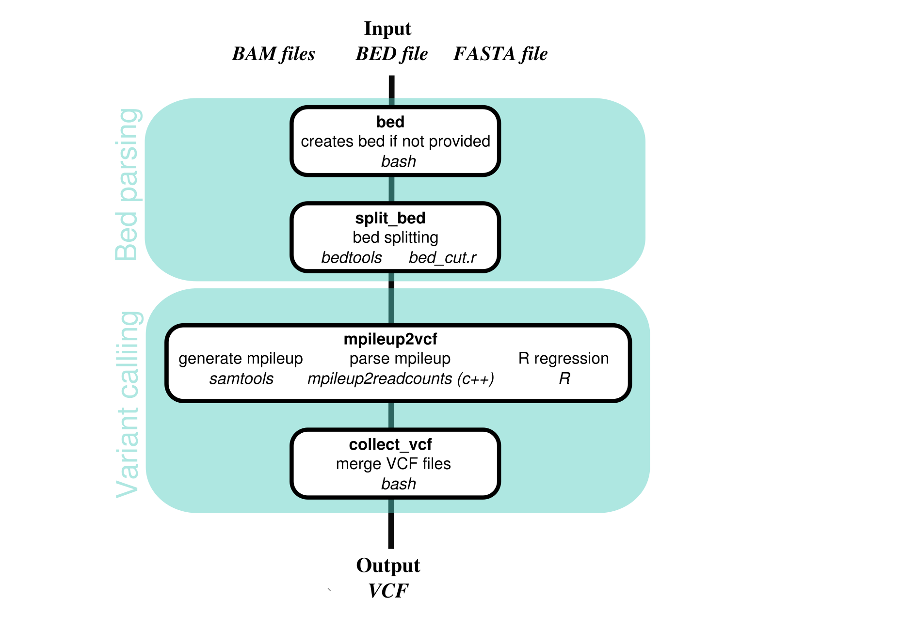
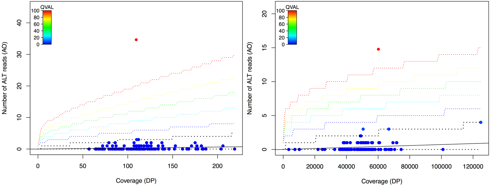
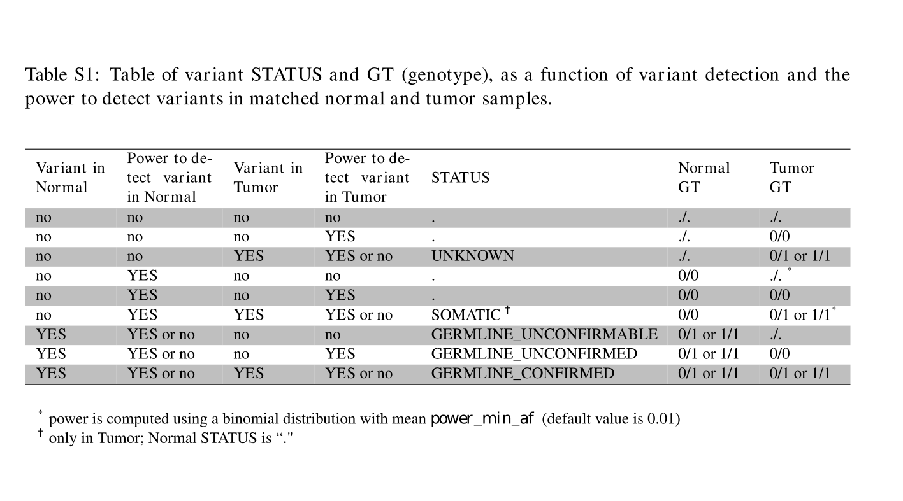
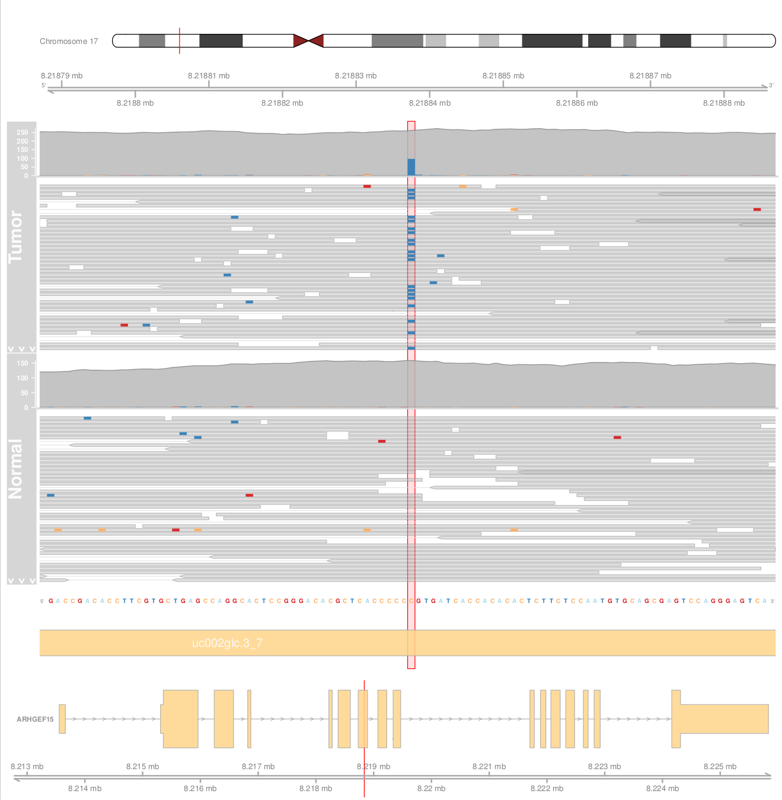

## A multi-sample somatic variant caller


[](https://gitter.im/iarcbioinfo/needlestack?utm_source=badge&utm_medium=badge&utm_campaign=pr-badge&utm_content=badge) [](https://circleci.com/gh/IARCbioinfo/needlestack/tree/master) [](https://hub.docker.com/r/iarcbioinfo/needlestack/)

Warning: development in progress, unreliable results warranted.

Please wait upcoming publication before using it in production.

Contact: follm@iarc.fr

Needlestack development is support by the US National Cancer Institute (grant number R21CA175979) and the French Institut national du cancer.



## WARNING
Since the last release, we have harmonized our [pipelines](https://github.com/IARCbioinfo/IARC-nf) and the following option names changed:
- `fasta_ref` is now `ref`
- `max_DP` is now `max_dp`
- `out_folder` is now `output_folder`
- `out_vcf` is now `output_vcf` and is now a mandatory argument
- `out_annotated_vcf` is now `output_annotated_vcf`
- `pairs_file` is now `tn_pairs`
- `no_plots` is now `plots` (see the Detailed description section)

## Description

Needlestack is an ultra-sensitive multi-sample variant caller for Next Generation Sequencing (NGS) data. It is based on the idea that analysing several samples together can help estimate the distribution of sequencing errors to accurately identify variants. It has been initially developed for somatic variant calling using very deep NGS data from circulating free DNA, but is also applicable to lower coverage data like Whole Exome Sequencing (WES) or even Whole Genome Sequencing (WGS). It is a highly scalable and reproducible pipeline thanks to the use of [nextflow](http://www.nextflow.io/) and [Docker](https://www.docker.com)/[Singularity](http://singularity.lbl.gov) container technologies.

Here is a summary of the method:

- At each position and for each candidate variant, we model sequencing errors using a negative binomial regression with a linear link and a zero intercept. The data is extracted from the BAM files using [samtools](http://www.htslib.org).
- Genetic variants are detected as being outliers from the error model. To avoid these outliers biasing the regression we use a robust estimator for the negative binomial regression (published [here](http://www.ncbi.nlm.nih.gov/pubmed/25156188) with code available [here](https://github.com/williamaeberhard/glmrob.nb)).
- We calculate for each sample a p-value for being a variant (outlier from the regression) that we further transform into q-values to account for multiple testing.

Note that needlestack is not performing a re-assembly of reads to determine haplotypes as some other modern variant callers are doing ([Mutect2](https://gatkforums.broadinstitute.org/gatk/discussion/11076/local-re-assembly-and-haplotype-determination-haplotypecaller-mutect2), Strelka2 etc.). For this reason we recommend using [ABRA2](https://github.com/mozack/abra2), a realigner for NGS data, before running needlestack. We also host a [nextflow pipeline for ABRA2](https://github.com/IARCbioinfo/abra-nf).

The detection of a variant can be visualized graphically. Here are two examples of a variant detected, one from a series of samples with a coverage of 120X (left) and one with a very high coverage (50000X, right). Each dot represents a sequenced sample colored according to its [Phred scale](https://en.wikipedia.org/wiki/Phred_quality_score) q-value. The black regression line shows the estimated sequencing-error rate along with the 99% confidence interval (black dotted lines) containing samples. Colored-dotted lines correspond to the limits of regions defined for different significance q-value thresholds. In both case one sample appears as outlier from the regression (in red), and is therefore classified as carrying the given mutation. Note that the position on the left has a high error rate, while the position on the right has a very low error rate, allowing the detection of a variant with a tiny allelic fraction (0.025%).


## Dependencies

Needlestack works under most Linux distributions and Apple OS X.

1. This pipeline is based on [nextflow](https://www.nextflow.io). As we host several nextflow pipelines, we have centralized the common information in the [IARC-nf](https://github.com/IARCbioinfo/IARC-nf) repository. Please read it carefully as it contains essential information for the installation, basic usage and configuration of nextflow and our pipelines.

2. External software:
 - [bedtools](http://bedtools.readthedocs.org/en/latest/)
 - [samtools](http://www.htslib.org)
 - [R](https://www.r-project.org) with Rscript
 - Compile the file *`mpileup2readcounts.cc`* located [here](https://github.com/IARCbioinfo/mpileup2readcounts)
 - Add the previous tools to your path (executables are assumed to be respectively called `samtools`, `Rscript` and `mpileup2readcounts`)
 - Optionally, the bioconductor packages required for the alignments plots (see the Detailed description section)

You can avoid installing all the external software by using [Docker](https://www.docker.com) or [Singularity](http://singularity.lbl.gov). See the [IARC-nf](https://github.com/IARCbioinfo/IARC-nf) repository for more information.

To use needlestack without nextflow, in addition to the previous tools, download the files in this [bin](https://github.com/IARCbioinfo/needlestack/tree/gabriela_cpp/bin) directory and add them to your path. See the Usage section to run needlestack without nextflow.


## Input
| Type      | Description     |
|-----------|---------------|
| [BAM files](https://samtools.github.io/hts-specs/)  | BAM files (called `*.bam`) grouped in a single folder or described in a text file (one BAM path per line) along with their [index files](http://www.htslib.org/doc/samtools.html) (called `*.bam.bai` or `*.bai`). A minimum of 20 BAM files is recommended. |
| [fasta file](https://en.wikipedia.org/wiki/FASTA_format)  |A reference fasta file (eventually compressed with [bgzip](http://www.htslib.org/doc/tabix.html)) along with its [faidx index](http://www.htslib.org/doc/faidx.html) (and `*.gzi` faidx index if compressed). |
| [bed file](https://genome.ucsc.edu/FAQ/FAQformat.html#format1) | Optional input file. Otherwise the variant calling is performed on the whole reference provided.|

A sample dataset is available [here](https://github.com/mfoll/NGS_data_test.git) for testing.

## Parameters

Type `--help` to get the full list of options. All parameters are prefixed with a double-dash like in `--help`.

  * #### Mandatory

| Name      | Example value | Description     |
|-----------|---------------|-----------------|
| `input_bams` |  `BAM/` or `bams.txt`| Folder containing the BAM files |
| `ref`   |        `fasta_name.fa`   | Reference fasta file  |
| `output_vcf`   | `vcf_name.vcf` | Name of the output VCF file generated by needlestack |

  * #### Optional

| Name      | Default value | Description     |
|-----------|---------------|-----------------|
| `min_dp`    |            `30` | Minimum median coverage to consider a site. In addition, at least 10 samples have to be covered by `min_dp`. |
| `min_ao` | `3` | Minimum number of non-ref reads in at least one sample to consider a site |
| `nsplit` | `1` | Split the bed file in nsplit pieces and run in parallel |
| `min_qval` | `50` | qvalue threshold in [Phred scale](https://en.wikipedia.org/wiki/Phred_quality_score) to consider a variant |
| `sb_type` | `SOR` | Strand bias measure, either `SOR`, `RVSB` or `FS` |
| `sb_snv` | `100` or `1000` | Strand bias threshold for SNVs. The default of 100 (1000 if `sb_type` is `FS`) means no filter |
| `sb_indel` | `100` or `1000` | Strand bias threshold for indels. The default of 100 (1000 if `sb_type` is `FS`) means no filter|
| `map_qual` | `0` | Min mapping quality (passed to `samtools`) |
| `base_qual` | `13` | Min base quality (passed to `samtools`) |
| `max_dp` | `30000` | Downsample coverage per sample (passed to `samtools`) |
| `plots` | `SOMATIC` if `tn_pairs` provided, `ALL` if not | Creates pdf plots of regressions in the output. To remove plots set `--plots` to `NONE` (See *Plot options* paragraph).|
| `genome_release` |  - | Reference genome for the annotions on the alignments plots. Examples: *`Hsapiens.UCSC.hg19`*, *`Hsapiens.UCSC.hg18`*, *`Hsapiens.UCSC.hg38`*, *`Mmusculus.UCSC.mm10`*. The right terminology is described below (*Plot options* paragraph). WARNING: this option is mandatory if the `--do_alignments` flag is used|
| `output_folder` | --bam_folder | Output folder, by default equals to the input bam folder |
| `bed` |  - | BED file containing a list of regions (or positions) where needlestack will perform variant calling |
| `region` |  - | A region in format CHR:START-END where calling should be done |
| `tn_pairs` | - | A tab-delimited file containing two columns (normal and tumor sample names) for each sample in line. This enables matched tumor/normal pair calling features (see below) |
| `sigma_normal` | `0.1` | Sigma parameter for negative binomial modeling of expected germline allelic fraction. We strongly recommend not to change this parameter unless you really know what it means |
| `min_af_extra_rob` | `0.2` | Minimum allelic fraction to exclude a sample at a position for extra-robust regression |
| `min_prop_extra_rob` | `0.1` | Minimum proportion of samples having an allelic fraction to be excluded from extra-robust regression |
| `max_prop_extra_rob` | `0.5` | Maximum proportion of samples having an allelic fraction to be excluded from extra-robust regression |


By default, if neither `--bed` nor `--region` are provided, needlestack runs on the whole reference genome provided, building a bed file from fasta index.
If `--bed` and `--region` are both provided, it runs on the region only.

  * #### Flags

Flags are parameters without value.

| Name      | Description     |
|-----------|-----------------|
| `help`    | Display help |
| `all_SNVs` | Output all SNVs, even when no variant is detected |
| `input_vcf` | A VCF file (from GATK) where calling should be done. Needlestack will extract DP and AO from this VCF (DP and AD fields) and annotate it with phred q-value score (`FORMAT/QVAL` field), error rate (`INFO/ERR`) and over-dispersion sigma parameter (`INFO/SIG`). WARNING: by default, only works with split (coreutils) version > 8.13 |
| `power_min_af` | Allelic fraction used to classify genotypes as 0/0 or ./. depending of the power to detect a variant at this fraction (see below) |
| `extra_robust_gl` | Perform extra-robust regression (useful for common germline SNPs, see below) |
| `no_labels` | No label for the outliers on regression plots |
| `no_indels` | Do not perform variant calling for insertions and deletions |
| `no_contours` | Do not plot q-values contours (for q-value threshold={10,30,50,70,100} by default) and do not plot minimum detectable allelic fraction as a function function of coverage |
| `use_file_name` | Use the bam file names as sample names. By default the sample name is extracted from the bam file `SM` tag |
| `do_alignments` | Add alignments plots to the pdf plots of regressions |

## Usage

1. Optionally download a sample dataset.

	```bash
	git clone --depth=1 https://github.com/IARCbioinfo/data_test
	```

2. Run the pipeline using nextflow (here using docker).

	```bash
	cd data_test
	nextflow run iarcbioinfo/needlestack -with-docker  \
	         --bed BED/TP53_all.bed --bam_folder BAM/BAM_multiple/ --ref REF/17.fasta --output_vcf all_variants.vcf \
					 --do_alignments --genome_release Hsapiens.UCSC.hg19
	```

	You will find a [VCF file](https://samtools.github.io/hts-specs/) called `all_variants.vcf` in the `BAM_multiple/` folder once done.

	The first time it will take more time as the pipeline will be downloaded from github and the docker container from [dockerhub](https://hub.docker.com/r/iarcbioinfo/needlestack/).

	Official releases can be found [here](https://github.com/iarcbioinfo/needlestack/releases/). There is a corresponding official [docker container](https://hub.docker.com/r/iarcbioinfo/needlestack/) for each release and one can run a particular version using (for example for v0.3):
		```bash
		nextflow run iarcbioinfo/needlestack -r v0.3 -with-docker \
		        --bed BED/TP53_all.bed --bam_folder BAM/BAM_multiple/ --fasta_ref REF/17.fasta --out_vcf all_variants.vcf
		```
It is also possible to run the pipeline without nextflow (not recommended) using the `needlestack.sh`. Here on the example dataset downloaded above:
	```bash
	cd data_test/
	needlestack.sh --region=17:7572814-7573814 --bam_folder=BAM/BAM_multiple --ref=REF/17.fasta --output_vcf=all_variants.vcf \
	               --do_alignments --genome_release=Hsapiens.UCSC.hg19
	```

## Output
  | Type      | Description     |
  |-----------|---------------|
  | [VCF file](https://samtools.github.io/hts-specs/)  | File containing all the variants detected. It contains a header of meta-information and data lines containing information about each variant position |
  | PDF files    | For each variant detected a pdf is generated, this pdf file contains the regression plots and alignments plots if the --do_alignments flag is used |


## Detailed description

### Germline, somatic, matched Tumor-Normal pairs calling and contamination

When using matched tumor/normal, Needlestack can classify variants (VCF `FORMAT/STATUS` field) according to the following table:


For this, one need to provide a tab-delimited file containing two columns with normal and tumor sample names using the `--tn_pairs` option. The first line of this file is a header with `TUMOR` and `NORMAL` keywords. When one normal or one tumor is missing, one can write `NA`. In this mode, the parameter `power_min_af` defines the allelic fraction in the tumor one is trying to detect to classify genotypes as `./.` or `0/0` depending on the power to detect this allelic fraction. Variants found as somatic in a tumor, but germline in another sample of the series will be flagged as `POSSIBLE_CONTAMINATION`. We found this particularly important, as needlestack is very sensitive to low allelic fractions, to filter out contamination among samples, coming for example from pooled exome capture.

In other cases (when there is no `--tn_pairs` parameter defined), genotypes are defined as `./.` or `0/0` assuming one is looking for allelic fractions expected for germline variants (negative binomial distribution centered at 0.5 with over-dispersion parameter sigma=`sigma_normal`, with `sigma_normal=0.1` by default). If you are looking for somatic variants without matched-normal and assuming you are interesting to correctly distinguish `./.` and `0/0`genotypes, you can set the `power_min_af` parameter to the lowest allelic fraction of somatic variants you are interested with (and your coverage allows you to find).  Note that this is by far not the most common situation, and that in most cases you don't have to worry about the `power_min_af` parameter.

### Plot options

#### Two options to consider:

1. `--plots`:
	* `SOMATIC`: produce pdf regression plots (like in the description above) only for somatic variants (option not available in the annotation mode). Default value when using matched tumor/normal.
	* `ALL`: produce pdf regression plots for all variants. Default value when not using matched tumor/normal or when using annotation mode.
	* `NONE`: remove pdf regression plots from the output.

2. `--do_alignments`: To add the alignments plots after the regression plots. If this flag is used, the name of the reference genome (`--genome_release` option) needs to be provided to choose the correct annotation (See *`--genome_release` option* below).

The following [bioconductor](https://bioconductor.org/) packages need to be installed for plotting the alignments:

- The [Gviz](https://bioconductor.org/packages/release/bioc/html/Gviz.html) package
- An [Annotation package for TxDb objects](http://bioconductor.org/packages/release/BiocViews.html#___TxDb).
- A [Genome wide annotation](https://bioconductor.org/packages/release/BiocViews.html#___OrgDb), it contains mappings between Entrez Gene identifiers and GenBank accession numbers. Examples: the Genome wide annotation package for Human: *`org.Hs.eg.db`* and for the mouse: *`org.Mm.eg.db`*.

Example: If the hg19 release of the human genome is used, the following packages should be installed: *`Gviz`*, *`TxDb.Hsapiens.UCSC.hg19.knownGene`* (hg18 and hg38 UCSC version can also be used) and *`org.Hs.eg.db`*

These packages exist for other organisms than Human but have not been tested. One can for example generate the alignments plot for mouse data by installing *`TxDb.Mmusculus.UCSC.mm10.knownGene`* (mm9 UCSC version can also be used) and *`org.Mm.eg.db`*. For the other organisms the packages need to have the same nomenclature as the ones listed above.

The `--genome_release` option needs to be provided and corresponds to the TxDb annotation package name without its prefix and suffix. For the hg19 release of the human genome, one needs to set `--genome_release` to *`Hsapiens.UCSC.hg19`*.
Note that the packages chosen for the annotations are compatible with the UCSC notations since most of the Gviz fonctionalities can handle these notations. The reference genome used for the BAM alignments can be based on GENCODE, UCSC or ENSEMBL genome varieties.



The alignment plot represents from top to bottom:
- Chromosome representation: a red vertical line shows the position of the variant.
- Genomic axis associated with the alignment.
- BAM alignment(s) (50 bases on both sides of the variant): the variant position is highlighted in red. Note that insertions and deletions are [not currently supported](https://support.bioconductor.org/p/95750/) by Gviz.
- The reference genome: the variant position is highlighted in red.
- Genome annotation: the yellow blocks represent exons, the variant position is highlighted in red. The annotation is represented only if the variant is not in an intergenic region.
- Zoom-out on the genome annotation: representation of the whole gene with its name on the left side. The annotation is represented only if the variant is not in an intergenic region. A red vertical line shows the position of the variant.
- Genomic axis corresponding to the previous gene annotation. A red vertical line shows the position of the variant.

### Common variants

Needlestack is designed to identify rare variants (i.e. only a few samples in your set of samples have a particular variant), because of the robust regression used. Therefore, common SNPs (>10%) or strong somatic hotspots will be missed. The optional `extra_robust_gl` can overcome partially this issue for common germline mutations: it first discard high allelic fraction (>20%, assuming these are likely true variants) before fitting the regression model when between 10% and 50% of sample have such a high allelic fraction. A flag is written in the VCF `INFO/WARN` field when this happened (`EXTRA_ROBUST_GL`). Additionally, when an other allele than the reference allele is the most common, it is taken as the reference allele and a flag is also written in the VCF (`INFO/WARN=INV_REF`).

### Strand bias

For conventional variant callers, GATK WES/WGS [recommended values](http://gatkforums.broadinstitute.org/discussion/5533/strandoddsratio-computation) for SOR strand bias are SOR < 4 for SNVs and < 10 for indels. We haven't found this particularly useful, but a more detailed evaluation is necessary. For amplicon based targeted sequencing, RVSB>0.85 seems to reduce some errors. There is no hard filter by default as this is easy to do afterward using [bcftools filter](http://samtools.github.io/bcftools/bcftools.html#filter) command.

## Directed Acyclic Graph


## Contributions

  | Name      | Email | Description     |
  |-----------|---------------|-----------------|
  | Matthieu Foll*    |          follm@iarc.fr | Lead developer, contact for support |
  | Tiffany Delhomme*    |            delhommet@students.iarc.fr | Main developer, contact for support |
  | Nicolas Alcala  |   alcalan@fellows.iarc.fr | tumor/normal pair mode, power calculation |
  | Aurelie Gabriel  |   gabriela@students.iarc.fr | Alignment plot, nextflow pipeline, mpileup2readcounts, bash version |

## References

A full methodological paper describing needlestack is in preparation. We have already used an early version in the two folowwing publications that you can cite in the meantime:
- Fernandez-Cuesta L, Perdomo S, Avogbe PH, Leblay N, Delhomme TM, Gaborieau V, Abedi-Ardekani B, Chanudet E, Olivier M, Zaridze D, Mukeria A, Vilensky M, Holcatova I, Polesel J, Simonato L, Canova C, Lagiou P, Brambilla C, Brambilla E, Byrnes G, Scelo G, Le Calvez-Kelm F, Foll M, McKay JD, Brennan P. Identification of Circulating Tumor DNA for the Early Detection of Small-cell Lung Cancer. [EBioMedicine](http://www.sciencedirect.com/science/article/pii/S2352396416302894). 2016 Aug;10:117-23. doi: [10.1016/j.ebiom.2016.06.032](http://dx.doi.org/10.1016/j.ebiom.2016.06.032). Epub 2016 Jun 25. PubMed PMID: [27377626](https://www.ncbi.nlm.nih.gov/pubmed/27377626); PubMed Central PMCID: [PMC5036515](https://www.ncbi.nlm.nih.gov/pmc/articles/PMC5036515/).
- Le Calvez-Kelm F, Foll M, Wozniak MB, Delhomme TM, Durand G, Chopard P, Pertesi M, Fabianova E, Adamcakova Z, Holcatova I, Foretova L, Janout V, Vallee MP, Rinaldi S, Brennan P, McKay JD, Byrnes GB, Scelo G. KRAS mutations in blood circulating cell-free DNA: a pancreatic cancer case-control. [Oncotarget](http://www.impactjournals.com/oncotarget/index.php?journal=oncotarget&page=article&op=view&path%5b%5d=12386). 2016 Nov 29;7(48):78827-78840. doi: [10.18632/oncotarget.12386](https://doi.org/10.18632/oncotarget.12386). PubMed PMID: [27705932](https://www.ncbi.nlm.nih.gov/pubmed/27705932); PubMed Central PMCID: [PMC5346680](https://www.ncbi.nlm.nih.gov/pmc/articles/PMC5346680/).
